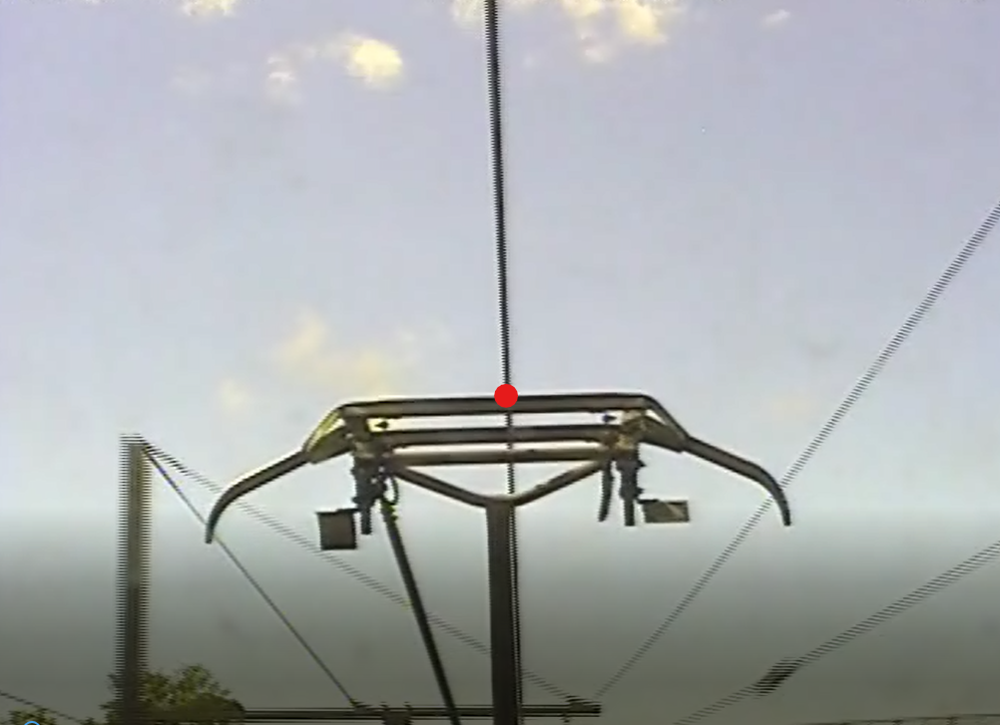

# Pantograph-Catenary-contact
This project aims to ensure train travel security as well as help the maintenance crew pinpoint where and when the contact between the train pantograph and catenary is ruptured because such an event ruptures the movement of the train and can cause complications. The crew can then fix the problem manually. 
To dot this, this code maps the contact point between the catenary and the pantograph bow given a video input. When the identified contact point leaves the pantograph "interval" we know there is a rupture.

[](https://www.youtube.com/watch?v=ek1j272iAmc)



## How to run the program?
Run the following:

OS X & Linux:

```sh
python contact_detection.py
```

Windows:

```sh
run.bat
```

## Required libraries

You need to install opencv2 and numpy for this project. 

```sh
pip install opencv-python
pip install numpy
```


<!-- Markdown link & img dfn's -->
[npm-image]: https://img.shields.io/npm/v/datadog-metrics.svg?style=flat-square
[npm-url]: https://npmjs.org/package/datadog-metrics
[npm-downloads]: https://img.shields.io/npm/dm/datadog-metrics.svg?style=flat-square
[travis-image]: https://img.shields.io/travis/dbader/node-datadog-metrics/master.svg?style=flat-square
[travis-url]: https://travis-ci.org/dbader/node-datadog-metrics
[wiki]: https://github.com/yourname/yourproject/wiki
